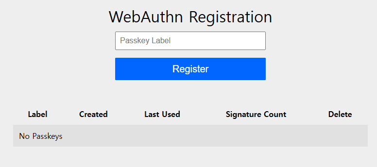
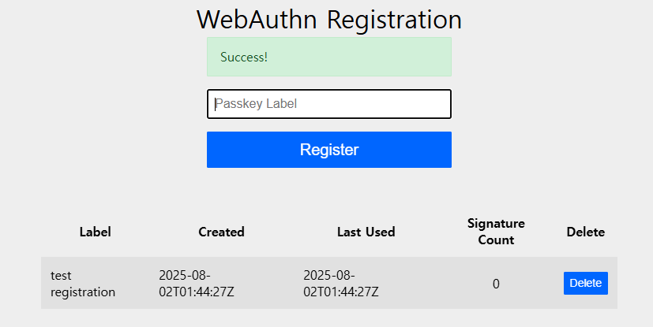

# WebAuthn(Passkey) with Spring Security

- [youtube](https://youtu.be/IkNO4q9aez8?si=dmmymXD6pCX5jCIc)


## How to use WebAuthn to Authenticate user?

1. [login](http://localhost:8080/login) user
    ```
    username: user
    password: password
    ```
2. register [WebAuthn](http://localhost:8080/webauthn/register)
   - enter passkey label 



3. after register, passkey will show up



