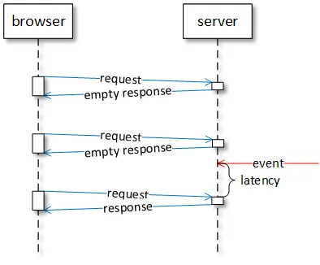
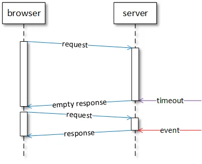
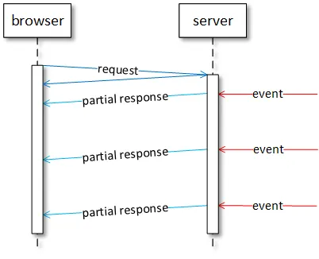

:toc:
:doctype: book
:icons: font
:icon-set: font-awesome
:source-highlighter: highlightjs
:toclevels: 4
:sectlinks:
:author: "mon0mon"
:hardbreaks:

== HTTP

=== HTTP Polling

HTTP 폴링 메커니즘에서는 클라이언트가 서버에 주기적 요청 서버는 즉시 응답, 새 데이터 있을 경우 반환, 없으면 빈 응답 클라이언트는 응답 후 잠시 대기 후 다음 요청

폴링은 서버 데이터 업데이트 주기 인지 시 효율 하지만 너무 드문 폴링 → 데이터 전송 지연 너무 잦은 폴링 → 서버 처리 능력·네트워크 자원 낭비

=== HTTP Long Polling

HTTP 롱 폴링 메커니즘에서는 클라이언트가 요청 후 응답 대기 서버는 새 데이터 도착 또는 타임아웃 시 응답 새 데이터 도착 시 클라이언트에 응답 전송

롱 폴링은 데이터 업데이트 수신 시 서버 처리·네트워크 자원 절약 특히 새 데이터 불규칙 도착 시 유용 단, 서버는 여러 열린 요청 추적 필요, 요청 타임아웃 가능 또한, 데이터 업데이트 없더라도 새 요청 주기 전송

=== HTTP Streaming

HTTP 스트리밍 메커니즘에서는 클라이언트가 요청 후 무기한 유지 서버는 새 데이터 도착 전까지 응답 보류, 도착 시 응답 일부로 전송

스트리밍은 서버가 응답 닫지 않고 여러 데이터 전송 가능 요청-응답 반복 불필요 → 네트워크 지연 최소화 단, 클라이언트와 서버는 응답 스트림 해석 방법 합의 필요 네트워크 중개자에 의한 스트리밍 방해 가능

=== Server Sent Events (SSE)

서버 전송 이벤트(SSE)는 표준 스트리밍 메커니즘 서버에서 브라우저로 단방향 UTF-8
이벤트 스트림 전송 브라우저는 EventSource API 사용 실패 시 클라이언트는 마지막 수신 이벤트 기반 자동 재연결

[open]
.SSE Request
--
[source]
----
GET /sse HTTP/1.1
Host: server.com
Accept: text/event-stream
----
--

[open]
.SSE Response
--
[source]
----
HTTP/1.1 200 OK
Connection: keep-alive
Content-Type: text/event-stream
Transfer-Encoding: chunked
retry: 1000
data: A text message
data: {"message": "a JSON message"}
event: text
data: A message of type 'text'
id: 1
event: text
data: A message of type 'text' with a unique identifier
:ping
----
--

> SSE는 서버에서 브라우저로만 데이터 스트리밍 · 텍스트 데이터 전용
