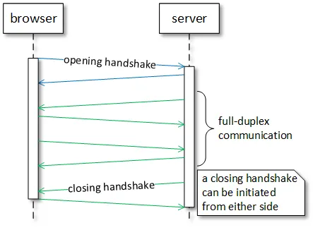

:toc:
:doctype: book
:icons: font
:icon-set: font-awesome
:source-highlighter: highlightjs
:toclevels: 4
:sectlinks:
:author: "mon0mon"
:hardbreaks:

= WebSocket

웹소켓은 HTTP 기반 한계 극복 목적으로 설계
클라이언트와 서버 간 전이중 통신 지원

> 전이중 통신 → 양쪽에서 동시에 메시지 주고받음
반이중 통신 → 한 번에 한 방향 메시지 교환

HTTP는 반이중 통신::
즉, 브라우저는 서버에 요청 보내거나 응답 수신 가능하지만 동시에 수행 불가
이 한계 극복을 위해 여러 Comet 메커니즘은 업스트림·다운스트림 통신 위해 두 개 HTTP 연결 사용 → 추가 복잡성 유발

웹소켓과 HTTP의 주요 차이::
* HTTP는 텍스트 프로토콜, 웹소켓은 이진 프로토콜
(이진 프로토콜은 네트워크 전송 데이터 양 소형)
* HTTP는 요청·응답 헤더 존재, 웹소켓 메시지는 불필요한 메타데이터 없이 특정 애플리케이션 형식
* HTTP는 반이중 프로토콜, 웹소켓은 전이중 프로토콜
(저지연 메시지 양방향 동시 전송)

== Design

웹소켓은 클라이언트(주로 브라우저)와 서버 간 텍스트·이진 메시지를 단일 TCP 연결 통해 양방향 전송
TCP의 80번 포트(ws 스킴) 또는 TLS/TCP의 443번 포트(wss 스킴) 사용

웹소켓은 HTTP와 독립적 TCP 기반 프로토콜이나 HTTP와 공존 설계
웹소켓 핸드쉐이크는 HTTP 서버에 의해 HTTP Upgrade 요청으로 해석
HTTP 및 HTTPS와 동일 80, 443 포트 공유

최소 수정으로 TCP 소켓 지원 → 브라우저-서버 통신 제공, 웹 보안 제약 준수
웹소켓은 TCP 위에 최소 기능 추가

* 출처 기반 보안 모델
* TCP IP 주소 → 웹 URL 변환
* 바이트 스트림 프로토콜 위에 메시지 프로토콜 추가
* 클로징 핸드쉐이크 제공

웹소켓 프로토콜은 간단 설계 → TCP 위 애플리케이션 서브프로토콜 구축 기반 제공
웹소켓 표준은 RFC 6455 · 웹소켓 API 구성

== WebSocket Protocol

웹소켓 네트워크 프로토콜은 두 구성 요소로 이루어짐

1. 웹소켓 연결 매개변수 협상 핸드쉐이크
2. 텍스트·이진 메시지 전송 위한 이진 메시지 프레이밍

=== Opening handshake

WebSocket은 기존 HTTP의 Upgrade 방식과 Sec-WebSocket-* 헤더들을 사용하여 연결을 수행

[oepn]
.HTTP에서 WebSocket으로의 upgrade 요청
--
[source, http, request]
----
GET /socket HTTP/1.1
Host: server.com
Connection: Upgrade
Upgrade: websocket
Origin: http://example.com
Sec-WebSocket-Version: 8, 13
Sec-WebSocket-Key: 7c0RT+Z1px24ypyYfnPNbw==
Sec-WebSocket-Protocol: v10.stomp, v11.stomp, v12.stomp
Sec-WebSocket-Extensions: permessage-deflate; client_max_window_bits
----
--

[open]
.HTTP에서 WebSocket으로의 upgrade 응답
--
[source, http, request]
----
HTTP/1.1 101 Switching Protocols
Connection: Upgrade
Upgrade: websocket
Access-Control-Allow-Origin: http://example.com
Sec-WebSocket-Accept: O1a/o0MeFzoDgn+kCKR91UkYDO4=
Sec-WebSocket-Protocol: v12.stomp
Sec-WebSocket-Extensions: permessage-deflate;client_max_window_bits=15
----
--

WebSocket 연결을 위한 핸드쉐이크에서는 다음 과정이 포함된다::
* protocol upgrade
* origin polices negotiation
* protocol negotiation
* subprotocol negotiation
* extension negotiation

==== Protocol Upgrade
* 클라이언트는 +Connection: Upgrade+와 +Upgrade: websocket+ 헤더가 포함된 요청을 보내야 함
* 서버에서는 +Connection: Upgrade+와 +Upgrade: websocket+ 헤더와 +101 Switching Protocols+ 응답을 보내야 함

==== Origin Policies Negotiation
* 클라이언트는 `Origin` 헤더를 통해 요청의 origin을 전달:
** schema, host, port를 포함
* 서버는 `Access-Control-Allow-Origin` 헤더를 통해 요청의 origin을 확인:
** `*` 로 모든 origin을 허용할 수 있음

==== Protocol Negotiation
* `Sec-WebSocket-Version` 헤더를 통해 지원하는 WebSocket 버전 전달
* `Sec-WebSocket-Key` 헤더를 통해 랜덤한 키를 전달
** link:https://datatracker.ietf.org/doc/html/rfc6455[RFC 6455]에 의하면 13을 사용해야 함
* 서버는 `Sec-WebSocket-Accept` 헤더를 통해 클라이언트의 키를 확인하고 `Sec-WebSocket-Protocol` 헤더를 통해 서버가 지원하는 프로토콜을 전달
** 클라이언트는 `Sec-WebSocket-Protocol` 헤더를 통해 서버가 지원하는 프로토콜을 확인

[open]
.Sec-WebSocket-Accept 계산
--
[source,java]
----
public static void main(String[] args) {
    // 클라이언트가 서버로 전송한 WebSocket 요청 헤더 중 하나인 Sec-WebSocket-Key의 값
    String key = "7c0RT+Z1px24ypyYfnPNbw==";
    String accept = Base64.getEncoder().encodeToString(
        MessageDigest.getInstance("SHA-1")
            // WebSocket 프로토콜에서 정의된 고정된 GUID 문자열
            .digest((key + "258EAFA5-E914-47DA-95CA-C5AB0DC85B11")
                .getBytes(StandardCharsets.UTF_8)));
    //  O1a/o0MeFzoDgn+kCKR91UkYDO4=
    System.out.println(accept);
}
----
--

==== Subprotocol Negotiation
* 클라이언트는 `Sec-WebSocket-Protocol` 헤더를 통해, 서브 프로토콜 목록을 전달
* 서버는 `Sec-WebSocket-Protocol` 헤더를 통해, 최종적으로 선택된 서브 프로토콜을 전달:
** 서버가 클라이언트로 전달 받은 서브 프로토콜을 지원하지 않는 경우, 연결 종료

==== Extension Negotiation
* 클라이언트는 `Sec-WebSocket-Extensions` 헤더를 통해, 확장 목록을 전달
* 서버는 `Sec-WebSocket-Extensions` 헤더를 통해, 하나 또는 둘 이상의 확장 목록을 선택하여 전달:
** 서버가 클라이언트로 전달 받은 확장을 지원하지 않더라도, 연결이 종료되지 않음

성공적인 핸드쉐이크가 종료되고 나서, 클라이언트와 서버 간의 WebSocket 전이중 통신이 가능해짐

=== Message Framing

웹소켓은 이진 메시지 프레이밍 사용
발신자는 애플리케이션 메시지 → 하나 이상의 프레임 분할 전송
수신자는 모든 프레임 수신 후 재조립하여 메시지 완성

웹소켓 프레이밍 형식

1. FIN (1비트) — 메시지 마지막 프레임 여부 표시
2. reserve (3비트) — 확장 위한 예약 플래그
3. operation code (4비트) — 프레임 유형 (데이터 프레임: 텍스트 또는 이진, 제어 프레임: 연결 종료, ping/pong)
4. mask (1비트) — 페이로드 데이터 마스킹 여부
5. payload length (7비트, 또는 7+16비트, 또는 7+64비트) — 가변 길이 페이로드 길이
6. masking key (0 또는 4바이트) — 페이로드 데이터 XOR에 사용되는 32비트 값
7. payload data (n바이트) — 확장 데이터(있을 경우)와 애플리케이션 데이터 포함

이진 메시지 프레이밍 사용 → 작은 메시지와 큰 메시지 간 프레이밍 오버헤드 절감
일부 자료에 따르면 HTTP 프로토콜 대비 약 500:1 트래픽 감소, 3:1 지연 감소

=== Closing handshake

클로징 핸드쉐이크는 어느 쪽에서든 시작 가능
클로징 프레임 수신 시 다른 쪽은 응답 클로징 프레임 전송
클로징 프레임 전송 후 해당 당사자 데이터 전송 중단
클로징 프레임 수신 측은 추가 데이터 폐기
양측 모두 클로징 프레임 전송·수신 후 웹소켓 연결 종료

추가로 상대방 부재 또는 기본 TCP 연결 종료 시 갑작스런 연결 종료 발생
클로징 프레임 상태 코드는 종료 이유 식별

== WebSocket API

웹소켓 API는 브라우저가 웹소켓 프로토콜 사용 서버 통신 위한 인터페이스
사용 전 브라우저 지원 여부 확인 필수

브라우저 웹소켓 지원 확인 코드

[source,javascript]
----
if (window.WebSocket) {
    // 웹소켓 지원
} else {
    // 웹소켓 미지원
}
----

서버 연결 설정 위해 API는 필수 서버 URL과 선택적 서브프로토콜 사용하는 WebSocket 생성자 제공
연결 설정 후 onopen 이벤트 리스너 호출
연결 후 protocol 및 extensions 속성 통해 서버 선택 연결 매개변수 확인

API는 현재 연결 상태 확인 위한 readyState 속성 제공
(연결 설정 여부, 미설정, 종료 또는 클로징 핸드쉐이크 중 상태)

API는 텍스트·이진 메시지 전송·수신 가능
텍스트 메시지 → UTF-8 인코딩, DOMString 객체 사용
이진 메시지 → Blob 객체 또는 ArrayBuffer 객체 사용
binaryType 속성 → 연결 사용 이진 객체 유형 지정

메시지 전송 위해 send 메서드 제공
(비차단적, 데이터 전송 큐 추가 후 즉시 반환)
bufferedAmount 속성 → 큐 추가 후 아직 네트워크 전송 미완료 바이트 수 반환

서버 수신 메시지 비차단적 처리 위해 이벤트 리스너 제공
주요 이벤트

- **onopen**: 연결 성공 시
- **onmessage**: 서버 메시지 수신 시 (메시지 → event.data)
- **onclose**: 연결 종료 시 (클로징 핸드쉐이크 완료 후)
- **onerror**: 연결 중 오류 발생 시

예시 웹소켓 브라우저 애플리케이션

[open]
.WebSocketExample.js
--
[source,javascript]
----
const ws = new WebSocket('ws://server.com/socket');
ws.binaryType = "blob"; // 이진 데이터 유형 설정

ws.onopen = function () {
    console.log("연결 열림");
    // 이진 메시지 전송
    ws.send(new Blob([new Uint8Array([0x48, 0x65, 0x6c, 0x6c, 0x6f, 0x21]).buffer]));
    // 텍스트 메시지 전송
    ws.send("Hello!");
}

ws.onclose = function () {
    console.log("연결 종료");
}

ws.onmessage = function(msg) {
    if (msg.data instanceof Blob) {
        console.log("이진 메시지 수신", msg.data);
    } else {
        console.log("텍스트 메시지 수신", msg.data);
    }
}

ws.onerror = function (error) {
    console.error("웹소켓 오류", error);
}
----
--

> 웹소켓 API는 애플리케이션에 프레이밍 정보나 ping/pong 메서드 노출 없이
클라이언트와 서버 간 통신 단순화
