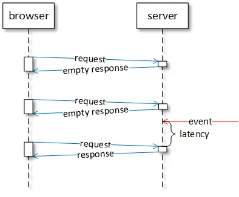
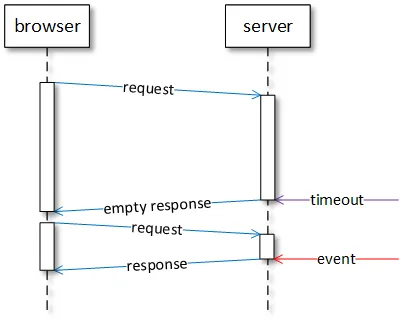
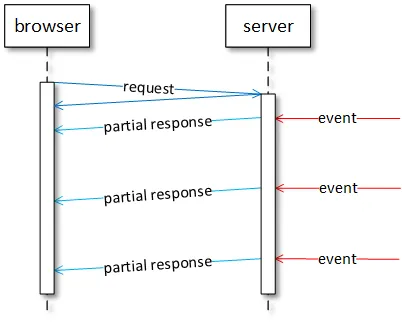
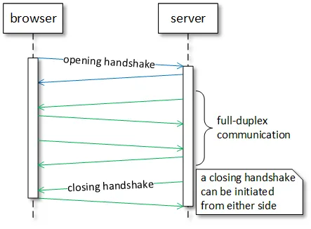

:toc:
:doctype: book
:icons: font
:icon-set: font-awesome
:source-highlighter: highlightjs
:toclevels: 4
:sectlinks:
:author: "mon0mon"
:hardbreaks:

= link:https://medium.com/swlh/websockets-with-spring-part-1-http-and-websocket-36c69df1c2ee[WebSockets With Spring, Part 1: HTTP and WebSocket]

= Introduction

HTTP 프로토콜은 _요청-응답_ 프로토콜입니다. 이는 클라이언트가 서버에 HTTP 요청을 보낼 수 있지만, 서버는 클라이언트의 요청이 없을 경우 응답을 보낼 수 없다는 것을 의미합니다. 이러한 설계는 HTTP가 본래 분산 하이퍼미디어 시스템에서 리소스를 전송하기 위해 개발되었기 때문입니다. 따라서 HTTP는 동시에 양방향 통신을 지원하지 않습니다.

이러한 아키텍처의 한계를 극복하기 위해 여러 HTTP 메커니즘이 개발되었습니다. 이들은 비공식적으로 _Comet_이라는 이름으로 그룹화되며, 종종 복잡하고 비효율적입니다.

웹소켓 프로토콜은 이러한 기존의 HTTP 메커니즘을 대체하고, 브라우저와 서버 간의 저지연, 양방향 통신을 위한 효과적인 프로토콜을 제공합니다. 웹소켓은 단일 TCP 연결을 통해 작동하며, 이는 데이터 전송의 효율성을 크게 향상시킵니다.

> 이 문서는 웹소켓과 HTTP/1.1 간의 관계를 설명합니다.

== HTTP

=== HTTP Polling

HTTP 폴링 메커니즘에서는 클라이언트가 서버에 주기적으로 요청을 보냅니다. 서버는 즉시 응답하며, 새로운 데이터가 있을 경우 이를 반환하고, 그렇지 않으면 빈 응답을 반환합니다. 클라이언트는 응답을 받은 후 잠시 대기한 뒤 다음 요청을 보냅니다.

폴링은 서버의 데이터 업데이트 주기를 알고 있을 때 효율적입니다. 그러나 클라이언트가 서버를 너무 드물게 폴링하면 데이터 전송에 추가적인 지연이 발생할 수 있으며, 너무 자주 폴링하면 서버의 처리 능력과 네트워크 자원을 낭비하게 됩니다.

=== HTTP Long Polling

HTTP 롱 폴링 메커니즘에서는 클라이언트가 서버에 요청을 보내고 응답을 기다립니다. 서버는 새로운 데이터가 도착하거나 타임아웃이 발생할 때까지 응답하지 않습니다. 새로운 데이터가 도착하면 서버는 클라이언트에게 응답을 보냅니다.

롱 폴링은 데이터 업데이트를 수신하는 데 있어 서버의 처리 및 네트워크 자원의 사용을 줄여줍니다. 특히 새로운 데이터가 불규칙적으로 도착할 때 유용합니다. 그러나 서버는 여러 열린 요청을 추적해야 하며, 롱 폴링 요청이 시간이 초과될 수 있습니다. 또한, 새로운 요청은 데이터가 업데이트되지 않더라도 주기적으로 전송되어야 합니다.

=== HTTP Streaming

HTTP 스트리밍 메커니즘에서는 클라이언트가 서버에 요청을 보내고, 그 요청을 무기한 유지합니다. 서버는 새로운 데이터가 도착할 때까지 응답하지 않으며, 새로운 데이터가 도착하면 서버는 이를 클라이언트에게 응답의 일부분으로 전송합니다.

스트리밍은 서버가 응답을 닫지 않고 여러 개의 데이터를 전송할 수 있는 기능에 기반합니다. 이 메커니즘은 클라이언트와 서버가 새로운 요청을 보내고 받을 필요가 없기 때문에 네트워크 지연을 크게 줄입니다. 그러나 클라이언트와 서버는 응답 스트림을 해석하는 방법에 대해 합의해야 하며, 네트워크 중개자가 스트리밍을 방해할 수 있습니다.

=== Server Sent Events (SSE)

서버 전송 이벤트(SSE)는 표준화된 스트리밍 메커니즘으로, 서버에서 브라우저로의 단방향 UTF-8 인코딩 이벤트 스트림을 정의합니다. SSE는 link:https://html.spec.whatwg.org/multipage/server-sent-events.html[EventSource API]를 사용하여 브라우저와 통신합니다. SSE는 실패 시 클라이언트가 마지막으로 수신한 이벤트에서 자동으로 재연결하는 기능을 지원합니다.

*

[open]
.SSE Request
--
[source]
----
GET /sse HTTP/1.1
Host: server.com
Accept: text/event-stream
----
--

[open]
.SSE Response
--
[source]
----
HTTP/1.1 200 OK
Connection: keep-alive
Content-Type: text/event-stream
Transfer-Encoding: chunked
retry: 1000
data: A text message
data: {"message": "a JSON message"}
event: text
data: A message of type 'text'
id: 1
event: text
data: A message of type 'text' with a unique identifier
:ping
----
--

> SSE는 서버에서 브라우저로만 스트리밍 데이터를 보낼 수 있으며, 텍스트 데이터만 지원합니다.

= WebSocket

웹소켓은 HTTP 기반 메커니즘의 한계를 극복하기 위해 설계된 프로토콜입니다. 웹소켓은 클라이언트와 서버 간의 전이중 통신을 지원합니다.

> 전이중 통신에서는 양쪽 모두 동시에 메시지를 보내고 받을 수 있습니다. 반면 반이중 통신에서는 양쪽이 메시지를 주고받을 수 있지만, 한 번에 한 방향으로만 가능합니다.

HTTP는 반이중 통신을 허용합니다. 즉, 브라우저는 서버에 요청을 보내거나 서버로부터 응답을 받을 수 있지만 동시에 두 작업을 수행할 수는 없습니다. 이러한 한계를 극복하기 위해 여러 Comet 메커니즘은 브라우저와 서버 간의 업스트림 및 다운스트림 통신을 위한 두 개의 동시에 HTTP 연결을 사용하여 추가적인 복잡성을 초래합니다.

여기 웹소켓과 HTTP의 주요 차이점이 있습니다:

* HTTP는 텍스트 프로토콜이며, 웹소켓은 이진 프로토콜입니다(이진 프로토콜은 네트워크를 통해 전송되는 데이터 양이 적습니다).
* HTTP는 요청 및 응답 헤더가 있으며, 웹소켓 메시지는 특정 애플리케이션에 적합한 형식을 가질 수 있습니다(불필요한 메타데이터가 전송되지 않습니다).
* HTTP는 반이중 프로토콜이며, 웹소켓은 전이중 프로토콜입니다(저지연 메시지가 양방향으로 동시에 전송될 수 있습니다).

== Design

웹소켓은 클라이언트(주로 브라우저)와 서버 간의 텍스트 및 이진 메시지를 단일 TCP 연결을 통해 동시에 양방향으로 전송할 수 있게 합니다. 웹소켓은 TCP의 80번 포트("ws" 스킴) 또는 TLS/TCP의 443번 포트("wss" 스킴)에서 통신할 수 있습니다.

웹소켓은 HTTP와 독립적인 TCP 기반 프로토콜로, HTTP와 공존하도록 설계되었습니다. 웹소켓 핸드쉐이크는 HTTP 서버에 의해 `HTTP Upgrade` 요청으로 해석되며, 웹소켓은 HTTP 및 HTTPS와 동일한 80 및 443 포트를 공유합니다.

웹소켓은 TCP 소켓을 지원하기 위해 최소한의 수정으로 브라우저-서버 통신을 제공하며, 웹의 보안 제약을 준수합니다. 웹소켓은 TCP 위에 다음과 같은 최소 기능만 추가합니다:

* 출처 기반 보안 모델
* TCP에서 사용되는 IP 주소를 웹에서 사용하는 URL로 변환
* 바이트 스트림 프로토콜 위에 메시지 프로토콜 추가
* 클로징 핸드쉐이크

웹소켓 프로토콜은 간단하게 설계되어 있으며, TCP 프로토콜 위에 애플리케이션 서브프로토콜을 구축할 수 있는 기반을 제공합니다. 웹소켓 표준은 link:https://tools.ietf.org/html/rfc6455[RFC 6455]로 표준화된 웹소켓 프로토콜과 link:https://html.spec.whatwg.org/multipage/web-sockets.html[웹소켓 API]로 구성됩니다.

== WebSocket Protocol

웹소켓 네트워크 프로토콜은 두 가지 구성 요소로 이루어져 있습니다:

1. 웹소켓 연결의 매개변수를 협상하는 핸드쉐이크
2. 텍스트 및 이진 메시지를 전송하기 위한 이진 메시지 프레이밍

=== Opening handshake

WebSocket은 기존 HTTP의 Upgrade 방식과 Sec-WebSocket-* 헤더들을 사용하여 연결을 수행

[oepn]
.HTTP에서 WebSocket으로의 upgrade 요청
--
[source, http, request]
----
GET /socket HTTP/1.1
Host: server.com
Connection: Upgrade
Upgrade: websocket
Origin: http://example.com
Sec-WebSocket-Version: 8, 13
Sec-WebSocket-Key: 7c0RT+Z1px24ypyYfnPNbw==
Sec-WebSocket-Protocol: v10.stomp, v11.stomp, v12.stomp
Sec-WebSocket-Extensions: permessage-deflate; client_max_window_bits
----
--

[open]
.HTTP에서 WebSocket으로의 upgrade 응답
--
[source, http, request]
----
HTTP/1.1 101 Switching Protocols
Connection: Upgrade
Upgrade: websocket
Access-Control-Allow-Origin: http://example.com
Sec-WebSocket-Accept: O1a/o0MeFzoDgn+kCKR91UkYDO4=
Sec-WebSocket-Protocol: v12.stomp
Sec-WebSocket-Extensions: permessage-deflate;client_max_window_bits=15
----
--

WebSocket 연결을 위한 핸드쉐이크에서는 다음 과정이 포함된다::
* protocol upgrade
* origin polices negotiation
* protocol negotiation
* subprotocol negotiation
* extension negotiation

==== Protocol Upgrade
* 클라이언트는 +Connection: Upgrade+와 +Upgrade: websocket+ 헤더가 포함된 요청을 보내야 함
* 서버에서는 +Connection: Upgrade+와 +Upgrade: websocket+ 헤더와 +101 Switching Protocols+ 응답을 보내야 함

==== Origin Policies Negotiation
* 클라이언트는 +Origin+ 헤더를 통해 요청의 origin을 전달:
** schema, host, port를 포함
* 서버는 +Access-Control-Allow-Origin+ 헤더를 통해 요청의 origin을 확인:
** +*+로 모든 origin을 허용할 수 있음

==== Protocol Negotiation
* 클라이언트는 +Sec-WebSocket-Version+ 헤더를 통해 지원하는 WebSocket 버전과 +Sec-WebSocket-Key+ 헤더를 통해 랜덤한 키를 전달
** link:https://datatracker.ietf.org/doc/html/rfc6455[RFC 6455]에 의하면 13을 사용해야 함
* 서버는 +Sec-WebSocket-Accept+ 헤더를 통해 클라이언트의 키를 확인하고 +Sec-WebSocket-Protocol+ 헤더를 통해 서버가 지원하는 프로토콜을 전달
** 클라이언트는 +Sec-WebSocket-Protocol+ 헤더를 통해 서버가 지원하는 프로토콜을 확인

[open]
.Sec-WebSocket-Accept 계산
--
[source,java]
----
public static void main(String[] args) {
    // 클라이언트가 서버로 전송한 WebSocket 요청 헤더 중 하나인 Sec-WebSocket-Key의 값
    String key = "7c0RT+Z1px24ypyYfnPNbw==";
    String accept = Base64.getEncoder().encodeToString(
        MessageDigest.getInstance("SHA-1")
            // WebSocket 프로토콜에서 정의된 고정된 GUID 문자열
            .digest((key + "258EAFA5-E914-47DA-95CA-C5AB0DC85B11")
                .getBytes(StandardCharsets.UTF_8)));
    //  O1a/o0MeFzoDgn+kCKR91UkYDO4=
    System.out.println(accept);
}
----
--

==== Subprotocol Negotiation
* 클라이언트는 +Sec-WebSocket-Protocol+ 헤더를 통해, 서브 프로토콜 목록을 전달
* 서버는 +Sec-WebSocket-Protocol+ 헤더를 통해, 최종적으로 선택된 서브 프로토콜을 전달:
** 서버가 클라이언트로 전달 받은 서브 프로토콜을 지원하지 않는 경우, 연결 종료

==== Extension Negotiation
* 클라이언트는 +Sec-WebSocket-Extensions+ 헤더를 통해, 확장 목록을 전달
* 서버는 +Sec-WebSocket-Extensions+ 헤더를 통해, 하나 또는 둘 이상의 확장 목록을 선택하여 전달:
** 서버가 클라이언트로 전달 받은 확장을 지원하지 않더라도, 연결이 종료되지 않음

성공적인 핸드쉐이크가 종료되고 나서, 클라이언트와 서버 간의 WebSocket 전이중 통신이 가능해짐

=== Message Framing

웹소켓은 이진 메시지 프레이밍을 사용합니다. 발신자는 각 애플리케이션 _메시지_를 하나 이상의 _프레임_으로 분할하여 네트워크를 통해 목적지로 전송합니다. 수신자는 모든 메시지가 수신된 후 이를 재조립하고 알림을 받습니다.

웹소켓 프레이밍 형식은 다음과 같습니다:

1. FIN (1 비트) — 메시지의 마지막 프레임인지 여부를 나타내는 플래그
2. reserve (3 비트) — 확장을 위한 예약 플래그
3. operation code (4 비트) — 프레임의 유형: 데이터 프레임(텍스트 또는 이진) 또는 제어 프레임(연결 종료, ping/pong)
4. mask (1 비트) — 페이로드 데이터가 마스킹되었는지 여부
5. payload length (7 비트, 또는 7+16 비트, 또는 7+64 비트) — 가변 길이 페이로드 길이
6. masking key (0 또는 4 바이트) — 페이로드 데이터를 XOR하는 데 사용되는 32비트 값
7. payload data (n 바이트) — 확장 데이터(사용되는 경우)와 애플리케이션 데이터가 포함된 페이로드 데이터

이러한 이진 메시지 프레이밍에서는 가변 길이 페이로드 길이 필드가 있어 작은 메시지와 큰 메시지 간의 프레이밍 오버헤드를 줄일 수 있습니다. 일부 소스에 따르면 웹소켓 프로토콜은 HTTP 프로토콜에 비해 약 500:1의 트래픽 감소와 3:1의 지연 감소를 제공할 수 있습니다.

=== Closing handshake

어느 쪽이든 클로징 핸드쉐이크를 시작할 수 있습니다. 클로징 프레임을 수신한 후, 다른 쪽은 응답으로 클로징 프레임을 보냅니다. 클로징 프레임을 보낸 후, 해당 당사자는 더 이상 데이터를 전송하지 않습니다. 클로징 프레임을 수신한 쪽은 수신된 추가 데이터를 폐기합니다. 양쪽 모두 클로징 프레임을 보내고 수신한 후, 해당 엔드포인트는 웹소켓 연결을 종료합니다.

클로징 핸드쉐이크 외에도 웹소켓 연결은 다른 쪽이 사라지거나 기본 TCP 연결이 종료될 때 갑자기 종료될 수 있습니다. 클로징 프레임의 상태 코드는 종료 이유를 식별할 수 있습니다.

== WebSocket API

웹소켓 API는 브라우저가 웹소켓 프로토콜을 사용하여 서버와 통신하기 위해 구현해야 하는 인터페이스입니다. 웹소켓 API를 사용하기 전에 브라우저가 이를 지원하는지 확인해야 합니다.

브라우저가 웹소켓을 지원하는지 확인하는 코드:

[source,javascript]
----
if (window.WebSocket) {
    // 웹소켓이 지원됨
} else {
    // 웹소켓이 지원되지 않음
}
----

서버에 연결을 설정하기 위해 API는 필수 서버 URL과 선택적 서브프로토콜을 사용하는 _WebSocket_ 생성자를 제공합니다. 연결이 설정되면 _onopen_ 이벤트 리스너가 호출됩니다. 연결 후에는 _protocol_ 및 _extensions_ 속성을 읽어 서버가 선택한 연결 매개변수를 확인할 수 있습니다.

API는 현재 연결 상태를 확인하기 위한 _readyState_ 속성을 제공합니다. 이 속성은 연결이 설정되었는지, 아직 설정되지 않았는지, 이미 종료되었는지, 종료 핸드쉐이크 중인지에 대한 정보를 제공합니다.

API는 텍스트 및 이진 메시지를 전송하고 수신할 수 있습니다. 텍스트 메시지는 UTF-8로 인코딩되며 _DOMString_ 객체를 사용합니다. 이진 메시지는 변경 불가능한 메시지를 위한 _Blob_ 객체 또는 수정 가능한 메시지를 위한 _ArrayBuffer_ 객체를 사용할 수 있습니다. _binaryType_ 속성은 연결에서 사용되는 이진 객체의 유형을 지정합니다.

API는 메시지를 전송하기 위한 _send_ 메서드를 제공합니다. 이 메서드는 비차단적이며, 데이터가 서버에 전송되도록 큐에 추가하고 즉시 반환됩니다. _bufferedAmount_ 속성은 _send_ 메서드를 사용하여 큐에 추가되었지만 아직 네트워크에 전송되지 않은 바이트 수를 반환합니다.

API는 비차단적으로 서버에서 수신된 메시지를 처리하기 위한 이벤트 리스너를 제공합니다. 주요 이벤트 리스너는 다음과 같습니다:

- **onopen**: 연결이 성공적으로 설정되었을 때 호출됩니다.
- **onmessage**: 서버로부터 메시지를 수신했을 때 호출됩니다. 메시지는 이벤트 객체의 `data` 속성에 포함됩니다.
- **onclose**: 연결이 종료되었을 때 호출됩니다. 이 이벤트는 클로징 핸드쉐이크가 완료된 후 호출됩니다.
- **onerror**: 연결 중 오류가 발생했을 때 호출됩니다.

예시 웹소켓 브라우저 애플리케이션:

[open]
.WebSocketExample.js
--
[source,javascript]
----
const ws = new WebSocket('ws://server.com/socket');
ws.binaryType = "blob"; // 이진 데이터 유형 설정

ws.onopen = function () {
    console.log("연결이 열렸습니다.");
    // 이진 메시지 전송
    ws.send(new Blob([new Uint8Array([0x48, 0x65, 0x6c, 0x6c, 0x6f, 0x21]).buffer]));
    // 텍스트 메시지 전송
    ws.send("Hello!");
}

ws.onclose = function () {
    console.log("연결이 종료되었습니다.");
}

ws.onmessage = function(msg) {
    if (msg.data instanceof Blob) {
        console.log("이진 메시지 수신:", msg.data);
    } else {
        console.log("텍스트 메시지 수신:", msg.data);
    }
}

ws.onerror = function (error) {
    console.error("웹소켓 오류:", error);
}
----
--

> 웹소켓 API는 애플리케이션에 프레이밍 정보나 ping/pong 메서드를 노출하지 않으며, 클라이언트와 서버 간의 통신을 단순화합니다.

= Example

== Java Spring

스프링 프레임워크는 웹소켓 클라이언트와 서버를 지원합니다. 아래는 서버와 클라이언트 간의 전이중 웹소켓 텍스트 통신 구현 예시입니다.

스프링 부트 애플리케이션에서 웹소켓을 설정하는 방법은 다음과 같습니다

* 의존성 추가: `spring-boot-starter-websocket` 의존성을 `pom.xml` 또는 `build.gradle`에 추가합니다.

* 웹소켓 구성: 웹소켓을 설정하는 구성 클래스를 생성합니다.

[open]
.WebSocketConfig.java
--
[source,java]
----
import org.springframework.context.annotation.Configuration;
import org.springframework.web.socket.config.annotation.EnableWebSocketMessageBroker;
import org.springframework.web.socket.config.annotation.StompEndpointRegistry;
import org.springframework.web.socket.config.annotation.WebSocketMessageBrokerConfigurer;

@Configuration
@EnableWebSocketMessageBroker
public class WebSocketConfig implements WebSocketMessageBrokerConfigurer {

    @Override
    public void registerStompEndpoints(StompEndpointRegistry registry) {
        registry.addEndpoint("/socket").withSockJS(); // SockJS 지원
    }

    @Override
    public void configureMessageBroker(MessageBrokerRegistry config) {
        config.enableSimpleBroker("/topic"); // 메시지 브로커 설정
        config.setApplicationDestinationPrefixes("/app");
    }
}
----
--

* 컨트롤러 생성: 클라이언트로부터 메시지를 수신하고 응답하는 컨트롤러를 생성합니다.

[open]
.WebSocketController.java
--
[source,java]
----
import org.springframework.messaging.handler.annotation.MessageMapping;
import org.springframework.messaging.handler.annotation.SendTo;
import org.springframework.stereotype.Controller;

@Controller
public class WebSocketController {

    @MessageMapping("/send")
    @SendTo("/topic/messages")
    public String sendMessage(String message) {
        return message; // 받은 메시지를 그대로 반환
    }
}
----
--

== JavaScript

브라우저 클라이언트는 표준화된 웹소켓 브라우저 객체를 사용하여 서버와 통신합니다. 다음은 JavaScript를 사용하여 웹소켓 클라이언트를 설정하는 예시입니다.

[open]
.WebSocketClient.js
--
[source,javascript]
----
const socket = new WebSocket('ws://localhost:8080/socket');

socket.onopen = function() {
    console.log('웹소켓 연결이 열렸습니다.');
    socket.send("Hello, server!"); // 서버에 메시지 전송
};

socket.onmessage = function(event) {
    console.log('서버로부터 메시지 수신:', event.data);
};

socket.onclose = function() {
    console.log('웹소켓 연결이 종료되었습니다.');
};

socket.onerror = function(error) {
    console.error('웹소켓 오류:', error);
};
----
--

== Java Spring client

자바 스프링 클라이언트는 스프링 웹소켓 이벤트 핸들러와 스프링 웹소켓 구성을 포함합니다. 스프링 클라이언트에서 웹소켓을 사용하려면 `spring-websocket` 의존성을 추가해야 합니다.

아래는 스프링 클라이언트에서 웹소켓을 사용하는 예시입니다:

[open]
.WebSocketClientExample.java
--
[source,java]
----
import org.springframework.messaging.simp.stomp.StompSession;
import org.springframework.messaging.simp.stomp.StompSessionHandlerAdapter;
import org.springframework.web.socket.client.WebSocketClient;
import org.springframework.web.socket.messaging.WebSocketStompClient;

public class WebSocketClientExample {

    public static void main(String[] args) {
        WebSocketClient client = new StandardWebSocketClient();
        WebSocketStompClient stompClient = new WebSocketStompClient(client);

        stompClient.connect("ws://localhost:8080/socket", new StompSessionHandlerAdapter() {
            @Override
            public void afterConnected(StompSession session, StompHeaders connectedHeaders) {
                session.subscribe("/topic/messages", new MessageHandler());
                session.send("/app/send", "Hello from Spring client!");
            }
        });
    }
}
----
--

= Conclusion

웹소켓은 HTTP 기반 솔루션의 한계를 해결하기 위해 설계된 통신 기술입니다. 웹소켓은 다음과 같은 경우에 유용합니다:

* 리소스의 업데이트를 저지연으로 받아야 할 때
* 고주파 메시지를 사용할 때
* 양방향 통신이 필요한 경우

HTTP는 다음과 같은 경우에 유용합니다:

* 리소스의 현재 상태를 받아야 할 때
* 요청-응답 통신 모델을 사용할 때
* 간단한 데이터 전송이 필요한 경우
