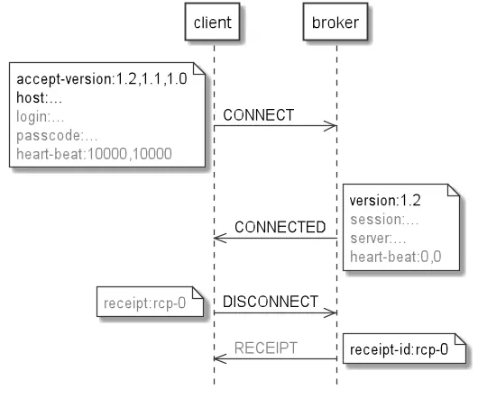
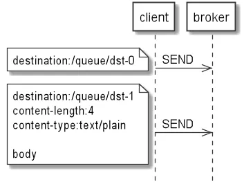
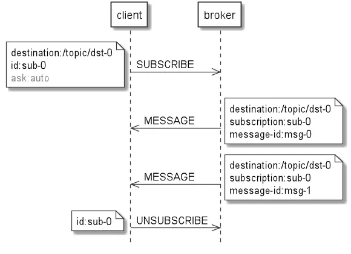
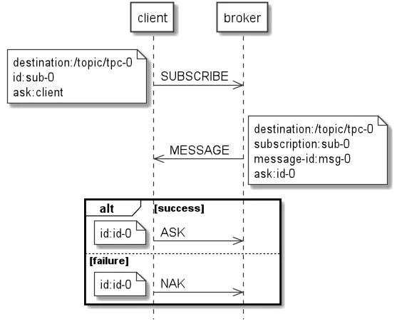
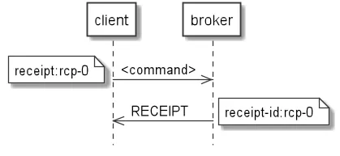

:toc:
:doctype: book
:icons: font
:icon-set: font-awesome
:source-highlighter: highlightjs
:toclevels: 4
:sectlinks:
:author: "mon0mon"
:hardbreaks:

== STOMP

=== Design

.STOMP(Simple/Streaming Text Oriented Message Protocol)
* 메시지 브로커 통해 클라이언트 간 메시징 위한 상호 운용 가능한 텍스트 기반 프로토콜
* 간단한 프로토콜
** 가장 많이 사용되는 메시징 기능 중 일부만 지원
* 스트리밍 프로토콜
** reliable bi-directional streaming network protocol(TCP, 웹소켓, 텔넷 등) 위에서 기능
* 텍스트 프로토콜
** 클라이언트와 메시지 브로커 간의 텍스트 기반 메시지 교환
** 프레임에는 필수 command와, 선택적 header 및 body를 포함
*** body는 한줄 공백을 두어서 구분

[open]
.프레임 구조
--
[source]
----
COMMAND
header1:value1
Header2:value2

body
----
--

* 메시징 프로토콜
** 클라이언트 메시지 생성 및 브로커 목적지로 전송, 구독 후 메시지 수신
* 상호 운용 가능한 프로토콜
** ActiveMQ, RabbitMQ, HornetQ, OpenMQ 등 여러 메시지 브로커 및 다양한 언어·플랫폼 클라이언트와 작동

=== Connecting clients to a broker

=== Connecting

브로커의 연결을 위해서는, 클라이언트에서 필수적인 2개의 헤더를 포함한 `CONNECT` 프레임을 전송해야 함

.필수
* `accept-version` : 클라이언트 지원 STOMP 프로토콜 버전
* `host` : 클라이언트 연결 원하는 가상 호스트 이름

.선택
* `version` : 세션 사용 STOMP 프로토콜 버전

=== Disconnecting

웹소켓 연결을 종료함으로, 클라이언트와 메시지 브로커 간의 연결을 종료할 수 있음
다만 이전에 보낸 프레임이 전부 메시지 브로커에게 전달되었다는 것을 보장할 수 없음

정상적인 연결 종료를 위해 클리이언트는 이전의 프레임들이 브로커에게 전달되었는지를 *확인* 할 필요가 있음

.연결 종료
. `receipt` 헤더를 포함한 `DISCONNECT` 프레임 전송
. `RECEIPT` 프레임 수신
. 웹소켓 연결 종료

=== Sending messages from clients to a broker

클라이언트는 메시지 브로커에게 메시지를 전송하기 위해 `SEND` 프레임을 전송해야 함

.필수
* `destination` : 클라이언트 전송 원하는 목적지

.선택
* `content-length` : `SEND` 프레임 본문의 길이
* `content-type` : `SEND` 프레임 본문의 타입

=== Subscribing clients to messages from a broker

==== Subscribing

클라이언트는 구독을 위해 `SUBSCRIBE` 프레임을 전송해야 함

.필수
* `destination` : 클라이언트 구독 원하는 목적지
* `id` : 구독 고유 식별자

=== Messaging

구독한 목적지로 메시지 전송을 위해 `MESSAGE` 프레임 전송

.필수
* `destination` : 메시지 전송된 목적지
* `subscription` : 메시지 수신 구독 식별자
* `message-id` : 메시지 고유 식별자

=== Unsubscribing

구독 해지를 위해 클라이언트는 `UNSUBSCRIBE` 프레임 전송해야함

.필수
* `id` : 구독 고유 식별자

=== Acknowledgment

프레임 수신 확인이 필요한 경우::
. 프레임이 중복 된 경우
. 프레임이 손실 된 경우
. 클라이언트나 브로커가 분산 시스템(distributed system)인 경우

==== Client messages acknowledgment

`SUBSCRIBE` 프레임, 메시지 인식 모드 제어 선택적 `ack` 헤더 포함 가능

.ack 모드
* auto
** 클라이언트의 메시지 수신 여부를 확인하지 않음
** 메시지 브로커는 모든 클라이언트가 메시지 수신했다고 가정
* client
** 클라이언트의 모든 메시지 수신 여부를 확인함
** 클라이언트의 모든 메시지 수신 확인을 위해, 이전에 전송받은 메시지를 포함하여 `ACK` 프레임 전송 필요
* client-individual
** 클라이언트의 특정 메시지 수신 여부를 확인함
** 특정 메시지만 `ACK` 프레임 전송 필요

.메시지 소비 여부
* `ACK` 프레임으로 메시지 소비를 전달
* `NAK` 프레임으로 메시지 소비가 되지 않음을 전달
* `id` 헤더를 통해 전달된 메시지의 `ack` 헤더와 대조할 수 있음

==== Broker commands acknowledgment

브로커, 클라이언트 인식 요청 프레임 성공 처리 후 `RECEIPT` 프레임 전송

RECEIPT 프레임에는 `receipt` 헤더와 일치하는 `receipt-id` 헤더 포함
