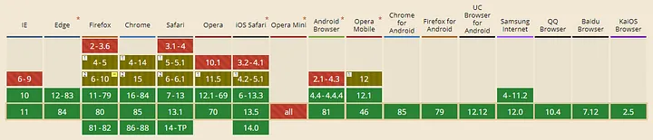

:toc:
:doctype: book
:icons: font
:icon-set: font-awesome
:source-highlighter: highlightjs
:toclevels: 4
:sectlinks:
:author: "mon0mon"
:hardbreaks:

= Introduction

link:https://caniuse.com/websockets[출처] 기준
웹소켓 API 현재(2025년) 일반 브라우저 구현
그러나 구형 브라우저(주로 모바일)와
네트워크 중개자(프록시, 방화벽, 라우터 등) 상황 존재

중개자 → HTTP에서 웹소켓 프로토콜 업그레이드 미허용 또는
장시간 연결 종료 가능

문제 해결책 중 하나
웹소켓 에뮬레이션
먼저 웹소켓 사용 후
동일 API 노출 HTTP 기반 기술 폴백

include::docs/01_SockJS.adoc[]

include::docs/02_Examples.adoc[]
